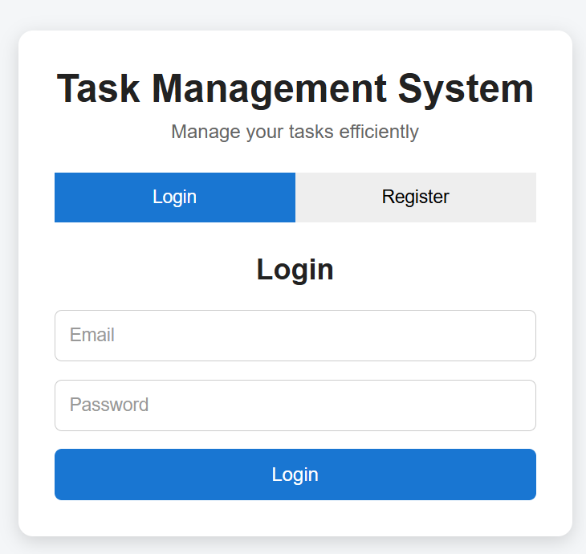
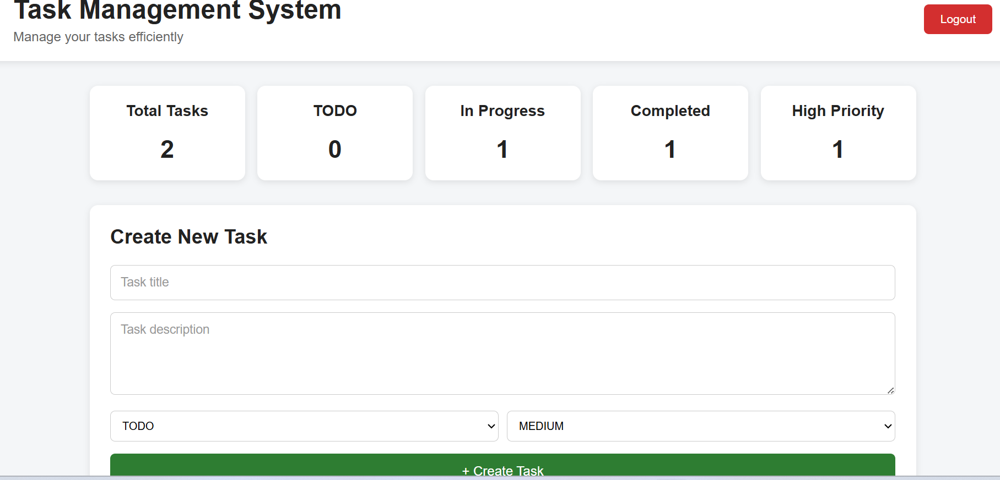
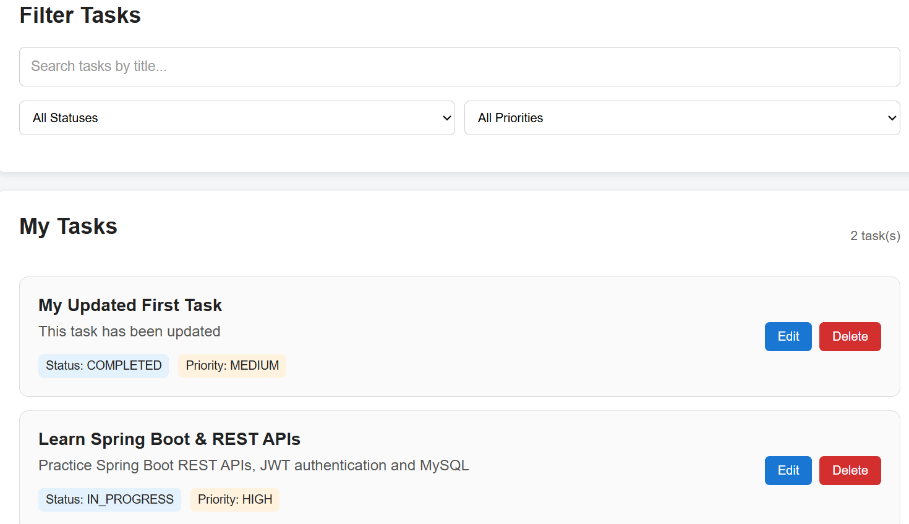

# Task Management System

A full-stack web application for managing personal tasks, built with **React** and **Spring Boot**. The application provides secure JWT-based authentication, task management, search and filtering, and a dashboard with task analytics.

## Features

* User registration and login
* JWT-based authentication
* Create, view, update, and delete tasks
* Filter tasks by status
* Filter tasks by priority
* Search tasks by title
* Dashboard with task analytics
* Loading and error states
* REST API integration
* MySQL database integration

## Technology Stack

### Frontend

* React
* JavaScript
* Vite
* HTML5
* CSS3

### Backend

* Java
* Spring Boot
* Spring Security
* JWT
* REST APIs
* Maven

### Database

* MySQL

### Development Tools

* Visual Studio Code
* MySQL Workbench
* Postman
* Git
* GitHub

## Project Structure

```text
task-management-system/
│
├── backend/
│   ├── src/
│   │   └── main/
│   │       ├── java/
│   │       │   └── com/taskmanagement/
│   │       └── resources/
│   ├── pom.xml
│   └── api-test.http
│
├── frontend/
│   ├── src/
│   ├── package.json
│   └── vite.config.js
│
└── README.md
```

## Application Flow

```text
User
 │
 ▼
React Frontend
 │
 │ HTTP / REST API
 ▼
Spring Boot Backend
 │
 ├── JWT Authentication
 ├── Task Management
 └── Business Logic
 │
 ▼
MySQL Database
```

## Running the Project Locally

### Prerequisites

* Java
* Maven
* Node.js and npm
* MySQL
* Git

### 1. Clone the Repository

```bash
git clone https://github.com/sanjaymadduri54/task-management-system.git
cd task-management-system
```

### 2. Configure the Database

Create the required MySQL database and configure the following environment variables on your system:

```text
DB_PASSWORD
JWT_SECRET
```

### 3. Start the Backend

From the project root:

```powershell
cd backend
.\mvnw.cmd spring-boot:run
```

The Spring Boot backend runs on:

```text
http://localhost:8080
```

### 4. Start the Frontend

Open another terminal:

```powershell
cd frontend
npm install
npm run dev
```

Open the local URL displayed by Vite in your browser.

## Main API Endpoints

### Authentication

```text
POST /api/auth/register
POST /api/auth/login
```

### Tasks

```text
GET    /api/tasks
POST   /api/tasks
PUT    /api/tasks/{id}
DELETE /api/tasks/{id}
```

Task endpoints require authenticated requests using JWT bearer authentication.

## Testing

The application was tested by verifying:

* User registration
* User login
* JWT-protected task access
* Task creation
* Task retrieval
* Task updates
* Task deletion
* Status filtering
* Priority filtering
* Title search
* Dashboard analytics
* Loading state
* Backend error handling

API requests can also be tested using the included:

```text
backend/api-test.http
```

## Screenshots

### Login & Register



### Dashboard



### Tasks, Search and Filters



## Future Improvements

Possible future enhancements include:

* Task due dates and reminders
* Advanced analytics and charts
* Pagination for larger task lists
* User profile management
* Role-based access control
* Cloud deployment
* Automated unit and integration testing

## Project Summary

**Task Management System**

A full-stack project demonstrating practical experience with:

**React · Java · Spring Boot · Spring Security · JWT · REST APIs · MySQL · Git/GitHub**

**GitHub Repository:**

https://github.com/sanjaymadduri54/task-management-system
